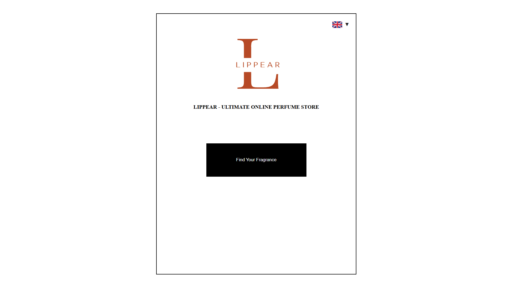
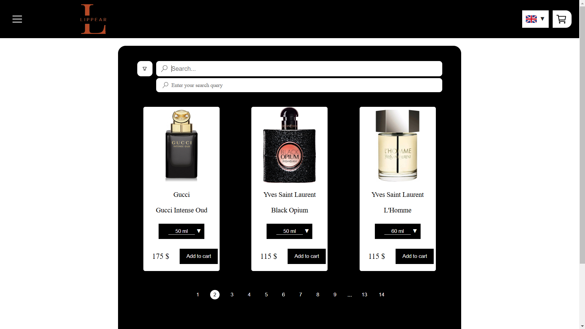
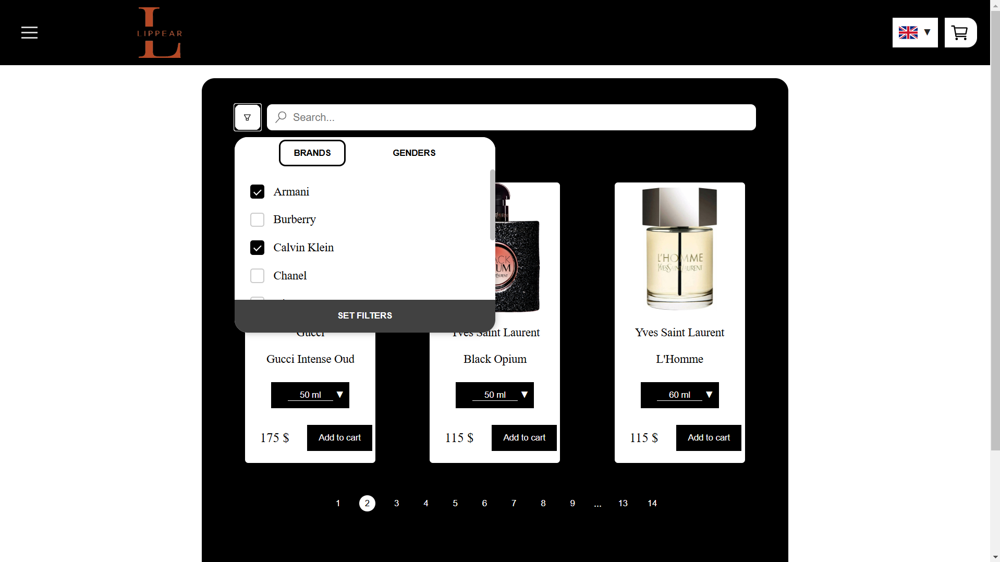
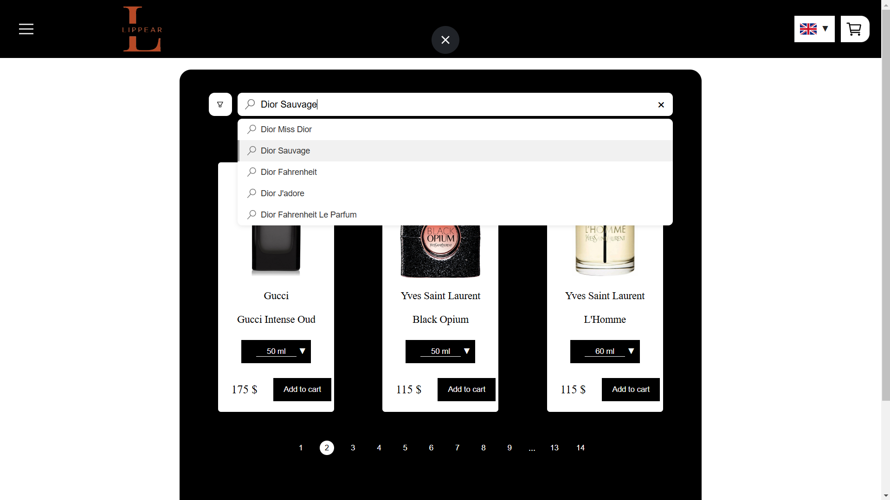
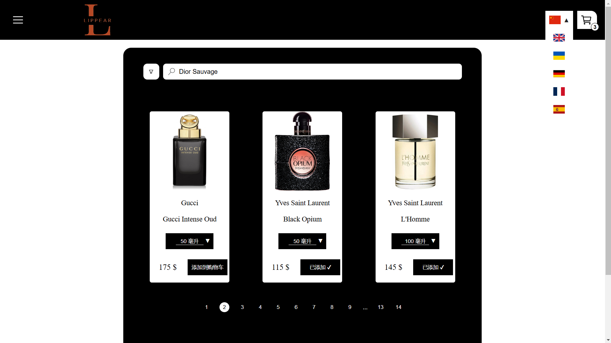
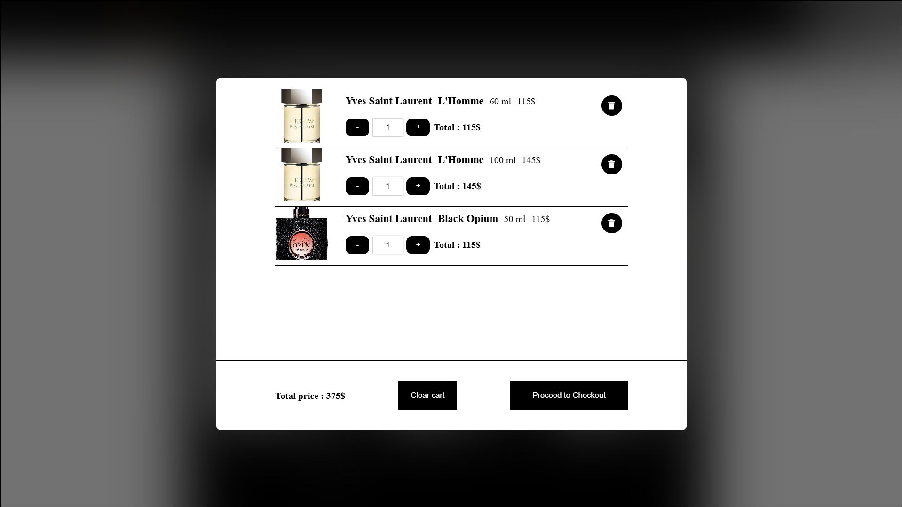

# Lippear - fragrance shop

## Functionality / Функціональність

- Search bar / Рядок пошуку
- Filters / Фільтри
- Language switch / Зміна мови
- Adding a product to the cart / Додавання товару в кошик
- Selecting the desired perfume volume / Вибір потрібного об'єму парфуму

## Technologies / Технології

- React
- JavaScript
- Vite
- SCSS
- Redux Toolkit
- React Router
- MongoDB

### Installation and Setup / Встановлення та запуск

- 1. git clone https://github.com/Lippear/Fullstack-project
- 2. cd Fullstack-project 
- 3. cd client
- 4. yarn install
- 5. cd ../Mongo-Node-db
- 6. npm install
- 7. IN client terminal - "yarn dev"
- 8.  IN Mongo-Node-db terminal - "node server.js" 

